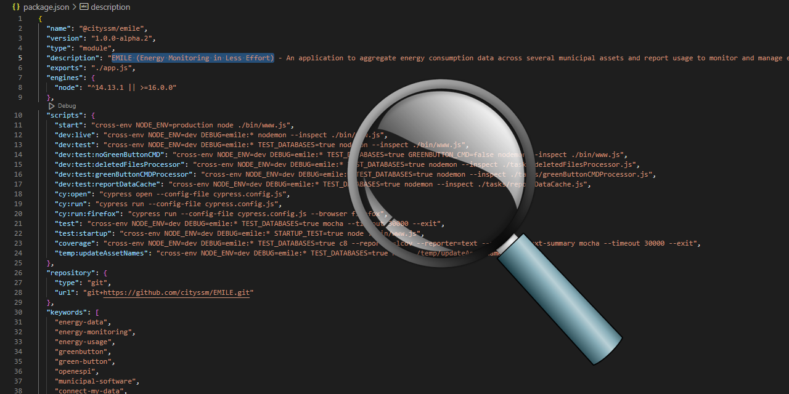

# eslint-config-cityssm

[](https://app.deepsource.com/gh/cityssm/eslint-config-cityssm/)



[ESLint](https://eslint.org/) rules used in the
[City of Sault Ste. Marie's TypeScript projects](https://github.com/search?q=org%3Acityssm++language%3ATypeScript&type=repositories).

Now testing support for ESLint's CSS, JSON, and Markdown parsers!

## Installation

```sh
npm install --save-dev eslint-config-cityssm
```

## Simple Usage

For web applications, export the default export.

```javascript
export { default } from 'eslint-config-cityssm'
```

For simpler packages, export the `packageConfig`.

```javascript
export { default } from 'eslint-config-cityssm/packageConfig'
```

## Advanced Usage (TypeScript)

```typescript
import configWebApp {
  type ConfigObject,
  defineConfig
} from 'eslint-config-cityssm'

export const config: ConfigObject[] = defineConfig(configWebApp, {
  files: ['**/*.ts'],
  languageOptions: {
    parserOptions: {
      project: ['./tsconfig.json', './public/javascripts/tsconfig.json']
    }
  },
  rules: {
    '@typescript-eslint/no-unsafe-type-assertion': 'off'
  }
})

export default config
```

## Included Plugins

**Thanks to all of the developers who help make the City of Sault Ste. Marie's
code awesome!** 😎

- [typescript-eslint](https://github.com/typescript-eslint/typescript-eslint)
- [eslint-config-love](https://www.npmjs.com/package/eslint-config-love)
- [@eslint-community/eslint-plugin-eslint-comments](https://www.npmjs.com/package/@eslint-community/eslint-plugin-eslint-comments)
- [eslint-plugin-express-security](https://www.npmjs.com/package/eslint-plugin-express-security)
- [eslint-plugin-browser-security](https://www.npmjs.com/package/eslint-plugin-browser-security)
- [eslint-plugin-jsdoc](https://www.npmjs.com/package/eslint-plugin-jsdoc)
- [eslint-plugin-n](https://www.npmjs.com/package/eslint-plugin-n)
- [eslint-plugin-node-dependencies](https://www.npmjs.com/package/eslint-plugin-node-dependencies)
- [eslint-plugin-node-security](https://www.npmjs.com/package/eslint-plugin-node-security)
- [eslint-plugin-package-json](https://www.npmjs.com/package/eslint-plugin-package-json)
- [eslint-plugin-perfectionist](https://www.npmjs.com/package/eslint-plugin-perfectionist)
- [eslint-plugin-promise](https://www.npmjs.com/package/eslint-plugin-promise)
- [eslint-plugin-regexp](https://www.npmjs.com/package/eslint-plugin-regexp)
- [eslint-plugin-secure-coding](https://www.npmjs.com/package/eslint-plugin-secure-coding)
- [eslint-plugin-sonarjs](https://www.npmjs.com/package/eslint-plugin-sonarjs)
- [eslint-plugin-sqlite-security](https://www.npmjs.com/package/eslint-plugin-sqlite-security)
- [eslint-plugin-unicorn](https://www.npmjs.com/package/eslint-plugin-unicorn)
- [eslint-plugin-write-good-comments-2](https://www.npmjs.com/package/eslint-plugin-write-good-comments-2)
- [html-eslint](https://github.com/yeonjuan/html-eslint)

## Projects Using eslint-config-cityssm

[**Used in 70+ projects**](https://github.com/search?q=eslint-config-cityssm+path%3A**%2Fpackage.json&type=code),
including:

- [EMILE (Energy Monitoring in Less Effort)](https://github.com/cityssm/EMILE)

- [Attendance Tracking](https://github.com/cityssm/attendance-tracking)

- [General Licence Manager](https://github.com/cityssm/general-licence-manager)

## Related Projects

**[prettier-config-cityssm](https://github.com/cityssm/prettier-config-cityssm)**<br />
Prettier configuration for the City of Sault Ste. Marie's projects.
